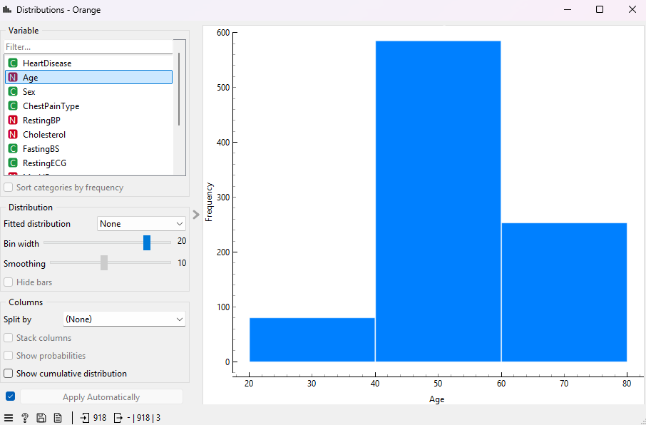
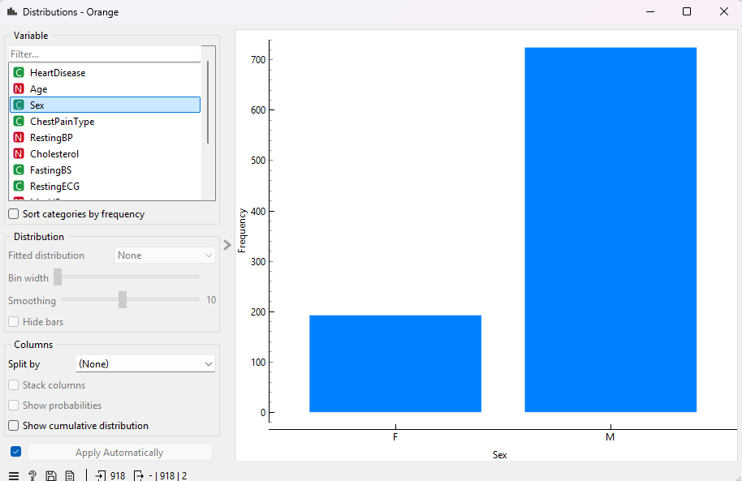
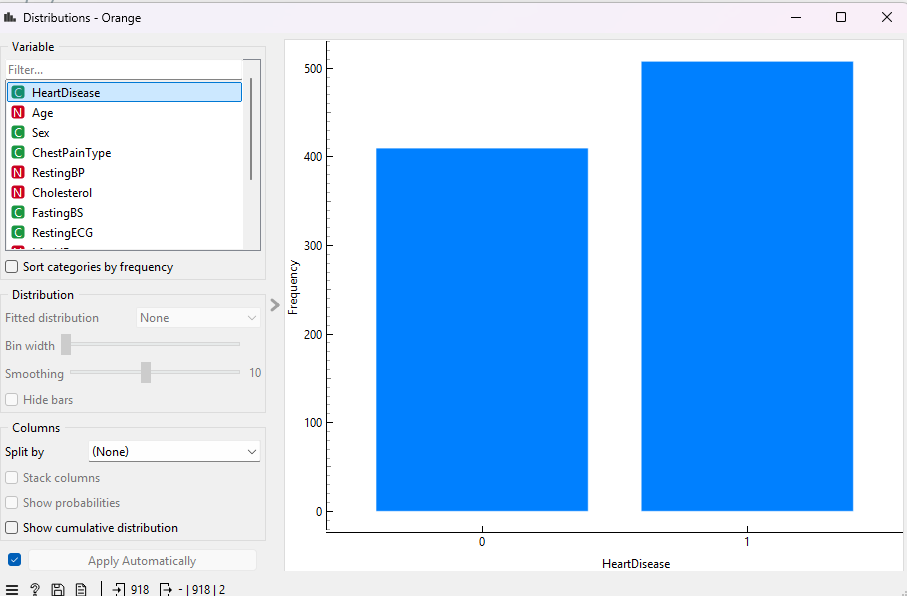
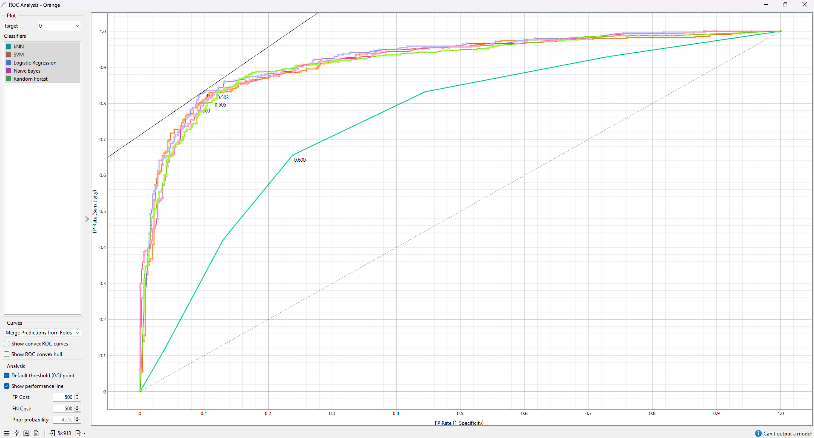
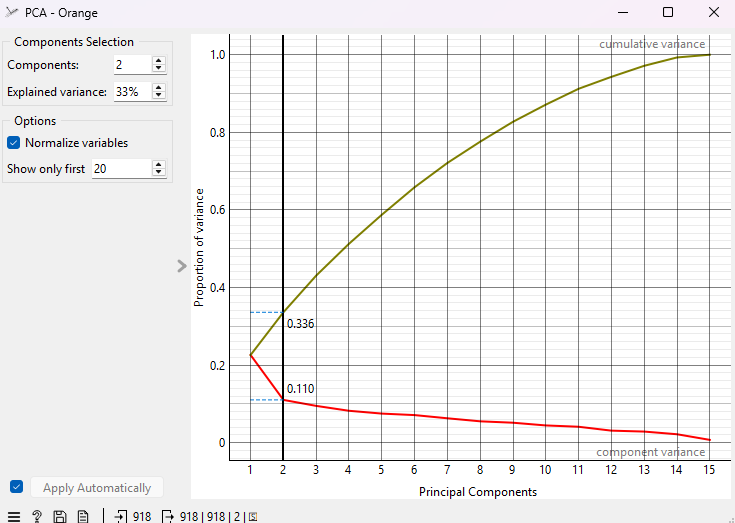
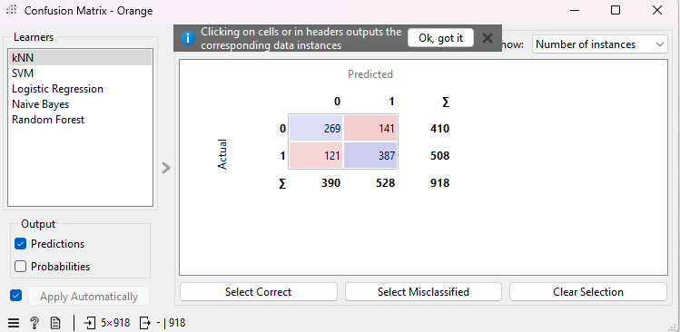
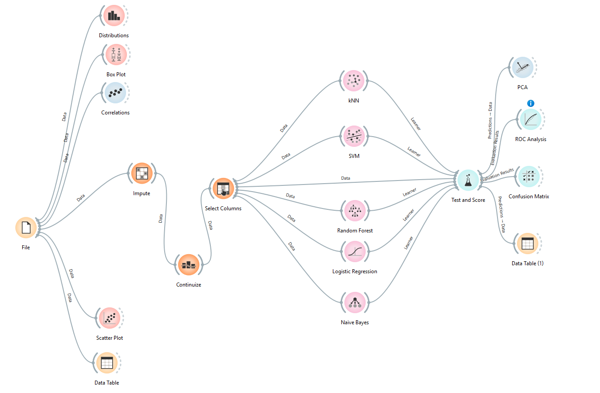

# YMT5270 Ara Sınav Projesi: Orange ile Veri Analizi ve Makine Öğrenmesi

## Öğrenci Bilgileri
- **Ad Soyad**: Muhammed Efe DEVECİ
- **Öğrenci Numarası**: 241137130
- **E-posta**: 241137130@firat.edu.tr

## Proje Özeti
Bu projede, kalp hastalığı teşhisini veri madenciliği ve makine öğrenmesi yöntemleriyle analiz etmek amacıyla Kaggle üzerinden temin edilen bir veri seti kullanılmıştır. Veri seti; yaş, cinsiyet, kolesterol, kan basıncı, göğüs ağrısı tipi gibi bireysel sağlık bilgilerine ek olarak bireylerin kalp hastalığı durumu (var/yok) bilgilerini içermektedir.

Proje kapsamında öncelikle keşifsel veri analizi (EDA) gerçekleştirilmiş, özniteliklerin dağılımları incelenmiş ve aykırı değerler görselleştirilmiştir. Box Plot, Distributions ve Correlations bileşenleriyle veri hakkında ön bilgi edinilmiştir. Ardından, kNN, SVM, Random Forest, Logistic Regression ve Naive Bayes gibi sınıflandırma algoritmaları uygulanarak modeller eğitilmiş ve Test and Score bileşeni ile değerlendirilmiştir.

Modellerin başarıları; doğruluk, F1 skoru, ROC-AUC gibi metriklerle ölçülmüş, sonuçlar Confusion Matrix ve ROC Curve ile görselleştirilmiştir.

## Veri Seti
### Veri Seti Bilgileri
- **Veri Seti Adı**: Heart Disease Dataset
- **Kaynak**: *https://www.kaggle.com/datasets/fedesoriano/heart-failure-prediction*
- **Veri Seti Boyutu**: *918 satır, 12 sütun (11 öznitelik + 1 hedef değişken)*

### Veri Seti Tanımı
Bu çalışmada kullanılan veri seti, Kaggle üzerinden temin edilen Heart Disease veri setidir. Toplam 918 bireye ait gözlem içeren bu veri seti, kişisel sağlık verilerine ve kalp hastalığı teşhisine yönelik sınıflandırma problemleri için uygundur.

Veri setinde yer alan öznitelikler şunlardır:

Age: Kişinin yaşı (sayısal)

Sex: Cinsiyet bilgisi (M: Erkek, F: Kadın)

ChestPainType: Göğüs ağrısı tipi (ASY, ATA, NAP, TA)

RestingBP: Dinlenme halindeki kan basıncı (mm Hg)

Cholesterol: Serum kolesterol seviyesi (mg/dl)

FastingBS: Açlık kan şekeri > 120 mg/dl (0: Hayır, 1: Evet)

RestingECG: Dinlenme elektrokardiyografik sonuç (Normal, ST, LVH)

MaxHR: Egzersiz sırasında ulaşılan maksimum kalp atış hızı

ExerciseAngina: Egzersize bağlı anjina (Y: Evet, N: Hayır)

Oldpeak: Egzersizle indüklenen ST depresyonu

ST_Slope: Egzersiz sırasında ST segmentinin eğimi (Flat, Up, Down)

HeartDisease: Hedef değişken; kişinin kalp hastalığı olup olmadığı (0: Yok, 1: Var)

Veriler büyük olasılıkla geçmiş hasta kayıtları ve klinik test sonuçları üzerinden toplanmış olup, bireylerin yaş, cinsiyet ve sağlık verilerini temel alarak kalp hastalığına ilişkin bir tahmin modeli geliştirmeye olanak sağlar.

Veri seti dengeli bir sınıf dağılımına sahiptir ve eksik veri içermemektedir.

### Öznitelik Açıklamaları
| Öznitelik Adı       | Veri Tipi | Açıklama                                                        | Örnek Değer |
|---------------------|-----------|------------------------------------------------------------------|-------------|
| Age                 | Sayısal   | Kişinin yaşı                                                     | 52          |
| Sex                 | Kategorik | Cinsiyet (M: Erkek, F: Kadın)                                   | M           |
| ChestPainType       | Kategorik | Göğüs ağrısı tipi (ATA, NAP, ASY, TA)                           | ATA         |
| RestingBP           | Sayısal   | Dinlenme halindeki kan basıncı (mm Hg)                          | 130         |
| Cholesterol         | Sayısal   | Serum kolesterol düzeyi (mg/dl)                                 | 250         |
| FastingBS           | Kategorik | Açlık kan şekeri >120 mg/dl (0: Hayır, 1: Evet)                 | 1           |
| RestingECG          | Kategorik | Dinlenme EKG sonucu (Normal, ST, LVH)                           | Normal      |
| MaxHR               | Sayısal   | Egzersiz sırasında ulaşılan maksimum kalp atış hızı            | 172         |
| ExerciseAngina      | Kategorik | Egzersize bağlı göğüs ağrısı (Y: Var, N: Yok)                   | N           |
| Oldpeak             | Sayısal   | Egzersizle indüklenen ST depresyonu (mm)                        | 1.0         |
| ST_Slope            | Kategorik | ST segmentinin eğimi (Up, Flat, Down)                          | Flat        |
| HeartDisease (Hedef)| Kategorik | Kalp hastalığı var mı? (0: Yok, 1: Var)                         | 1           |

## Keşifsel Veri Analizi (Explanatory Data Analysis - EDA)
### Temel İstatistikler 
Veri setindeki yaş,cinsiyet ve hastalık gibi özelliklerin orange'daki distributions widget'i ile dağılımları gösterilmiştir.

 

### Veri Ön İşleme
Olası eksiklikleri tespit etmek amacıyla Impute bileşeni kullanılmıştır. Bu bileşen, eksik değer olması durumunda sayısal veriler için ortalama, kategorik veriler için en sık değerle doldurma işlemi gerçekleştirecek şekilde yapılandırılmıştır.

Dağılım analizleri Distributions, Box Plot ve Scatter Plot bileşenleri ile görselleştirilmiştir.

Orange arayüzünde doğrudan normalize bileşeni kullanılmamıştır. Ancak SVM ve kNN gibi algoritmaların içinde yer alan ön işlem seçenekleri aracılığıyla normalizasyon işlemleri modellerin içsel olarak uygulanmasını sağlamıştır.

Continuize bileşeni aracılığıyla kategorik değişkenler otomatik olarak sayısal formata dönüştürülmüştür. Bu dönüşüm sayesinde algoritmaların sayısal işlem yapabilmesi mümkün olmuştur.

Son olarak, Select Columns bileşeni kullanılarak hedef değişken (HeartDisease) açıkça tanımlanmış, model eğitimi için gerekli öznitelikler belirlenmiştir. Bu sayede makine öğrenmesi algoritmalarının doğru şekilde eğitilmesi sağlanmıştır.

### Görselleştirmeler
#### Görselleştirme 1: [ROC Eğrisi – Model Karşılaştırması]
 
Bu görselleştirme, farklı sınıflandırma algoritmalarının (kNN, SVM, Logistic Regression, Naive Bayes, Random Forest) ROC eğrisi üzerinden başarılarını kıyaslamaktadır.
ROC eğrisinin altında kalan alan (AUC) ne kadar büyükse modelin pozitif sınıfı ayırma başarısı o kadar yüksektir.
Görsele göre Logistic Regression ve SVM en başarılı modeller olarak öne çıkmaktadır.

#### Görselleştirme 2: [PCA – Boyut İndirgeme Görselleştirmesi]
 
PCA (Principal Component Analysis) yöntemi ile verideki en bilgilendirici bileşenler seçilmiş ve varyans katkıları analiz edilmiştir.
İlk iki bileşen verinin toplam varyansının %33’ünü açıklamaktadır. Bu da sınıflar arası ayrımı görselleştirmede kısmen yeterli bir düzey sunar.

#### Görselleştirme 3: [Confusion Matrix – KNN]
 
Bu görselleştirme, Logistic Regression modelinin tahmin performansını göstermektedir.
Gerçek değeri 0 (kalp hastalığı yok) olan 410 örnekten 269'u doğru, 141'i yanlış sınıflandırılmıştır.
Gerçek değeri 1 (kalp hastalığı var) olan 508 örnekten 387'si doğru, 121'i yanlış sınıflandırılmıştır.
Genel doğrulama başarısı oldukça iyidir ve özellikle sınıf 1 (hastalığı olan bireyler) için yüksek duyarlılık sergilenmiştir.

### Öznitelik İlişkileri
Veri setindeki öznitelikler arasındaki doğrusal ilişkiler, Pearson korelasyon katsayısı kullanılarak analiz edilmiştir. Orange aracıyla oluşturulan korelasyon matrisi sonuçlarına göre en dikkat çekici ilişki, Age (yaş) ile MaxHR (maksimum kalp atım hızı) arasındaki -0.382 korelasyon katsayısıdır. Bu negatif ilişki, yaş arttıkça maksimum kalp atım hızının azaldığını göstermektedir.

Diğer dikkat çeken korelasyonlar:

Age ile Oldpeak: +0.259 (yaş arttıkça ST depresyonu artıyor olabilir)

Age ile RestingBP: +0.254

Cholesterol ile MaxHR: -0.236

Oldpeak ile RestingBP: +0.165

Bu değerlerin hiçbiri güçlü (|r| > 0.7) bir korelasyon göstermemektedir. Ancak yine de zayıf veya orta düzeyde korelasyonlar, modelin yorumlanmasında ve öznitelik mühendisliğinde önemli olabilir.

## Makine Öğrenmesi Uygulaması
### Kullanılan Yöntem
Bu projede hedef değişken olan HeartDisease kategorik (0: yok, 1: var) olduğundan dolayı sınıflandırma yöntemi uygulanmıştır.
Amaç, bireylerin sağlık bilgilerine dayanarak kalp hastalığı olup olmadığını öngörmektir.
Bu tür sınıflandırma problemleri için yaygın olarak kullanılan kNN, SVM, Random Forest, Logistic Regression ve Naive Bayes algoritmaları denenmiştir.

### Modeller ve Parametreler
Aşağıdaki modeller Orange platformunda varsayılan parametrelerle kullanılmıştır:

kNN (k-En Yakın Komşu): Varsayılan k=5 komşu sayısı ile çalıştırılmıştır.

SVM (Destek Vektör Makineleri): Lineer kernel ile uygulanmıştır.

Random Forest: 10 adet karar ağacı kullanılarak ensemble yöntemle sınıflandırma yapılmıştır.

Logistic Regression: Lojistik model doğrusal ayrım yaparak hedef sınıfı tahmin etmiştir.

Naive Bayes: Koşullu olasılıklar varsayımıyla çalışmış ve istatistiksel olarak güçlü performans göstermiştir.

Veri öncesinde Impute bileşeni ile eksik değerlerin ortalama ile doldurulması ve Continuize ile kategorik-sayısal dönüşümler sağlanmıştır.

### Model Değerlendirmesi
Model performansları 5 katlı çapraz doğrulama yöntemiyle değerlendirilmiştir. Aşağıdaki metrikler kullanılmıştır:

Doğruluk (Accuracy)

F1 Skoru

Duyarlılık (Recall)

Kesinlik (Precision)

ROC-AUC

En yüksek AUC değeri Logistic Regression (0.924) ile elde edilmiştir. Ancak Naive Bayes ve SVM modelleri de yüksek F1 skorları (%85-86) ile dikkat çekmiştir.
Görselleştirme olarak Confusion Matrix, ROC Eğrisi ve PCA analizi kullanılarak modeller arası karşılaştırma yapılmıştır.

#### Metrikler
### Metrikler
| Metrik                    | Değer  |
|---------------------------|--------|
| Doğruluk (CA)             | 0.865  |
| F1 Skoru (F1)             | 0.865  |
| Kesinlik (Precision)     | 0.865  |
| Duyarlılık (Recall)      | 0.865  |
| ROC-AUC Skoru (AUC)      | 0.924  |

### Sonuçların Yorumlanması
Yapılan sınıflandırma analizlerinde beş farklı model (kNN, SVM, Logistic Regression, Naive Bayes ve Random Forest) karşılaştırılmıştır. Elde edilen sonuçlara göre, en yüksek AUC ve doğruluk (CA) değerlerine ulaşan model Logistic Regression olmuştur. Bu modelin F1 skoru, duyarlılık (Recall) ve kesinlik (Precision) gibi metrikleri de oldukça dengelidir. Bu durum, Logistic Regression modelinin veri setindeki sınıfları ayırt etmede başarılı olduğunu göstermektedir.

SVM ve Naive Bayes modelleri de tatmin edici performans göstermiştir. Özellikle SVM, yüksek kesinlik değeriyle dikkat çekerken, Naive Bayes modeli duyarlılık açısından güçlü performans sergilemiştir.

Buna karşın, kNN modeli diğer modellere kıyasla daha düşük AUC ve F1 skorlarına sahiptir. Bu durum, kNN'nin veri setinin doğasına tam olarak uyum sağlayamadığını ve sınıflandırma kararlarını daha zayıf verdiğini göstermektedir.

Modelin güçlü yönleri arasında dengesiz veri setiyle başa çıkabilme, ROC eğrisi altında yüksek alan değeri ve genellikle yüksek F1 skoru yer alırken; zayıf yönleri arasında bazı modellerde (örneğin kNN) yüksek yanlış sınıflandırma oranı sayılabilir.

Alternatif olarak Gradient Boosting, XGBoost veya Neural Network gibi gelişmiş modeller de denenerek model başarısı daha da artırılabilir.

## Orange İş Akışı

File: İlk olarak, Kaggle’dan indirilen heart.csv veri seti projeye yüklenmiştir.

Impute: Eksik veriler kontrol edilerek, varsa uygun şekilde doldurulmuştur. Ancak bu veri setinde eksik veri bulunmamıştır.

Continuize: Kategorik veriler sayısal formata dönüştürülmüş ve modellerin doğru çalışabilmesi için dönüşüm yapılmıştır.

Select Columns: Hedef değişken (HeartDisease) açıkça belirtilmiş ve analizde kullanılacak öznitelikler seçilmiştir.

Makine Öğrenmesi Algoritmaları (kNN, SVM, Random Forest, Logistic Regression, Naive Bayes): Bu sınıflandırma algoritmaları veri setine uygulanmıştır.

Test and Score: 5 katlı çapraz doğrulama yöntemi kullanılarak modellerin performansı değerlendirilmiştir. AUC, Accuracy, Precision, Recall, F1 ve MCC gibi metriklerle ölçüm yapılmıştır.

PCA: Boyut indirgeme için Principal Component Analysis uygulanmış ve bileşenlerin varyans oranları görselleştirilmiştir.

ROC Analysis: Her model için ROC eğrileri çizilerek sınıflandırma başarıları kıyaslanmıştır.

Confusion Matrix: Doğru ve yanlış sınıflandırmalar detaylı olarak incelenmiştir.

Data Table (1): Modellerin yaptığı tahminler örnek veri üzerinden tablolaştırılmıştır.

Scatter Plot, Box Plot, Correlation, Distribution: EDA (keşifsel veri analizi) aşamasında verinin yapısı, dağılımı ve öznitelikler arası ilişkiler görselleştirilmiştir.

## Sonuç ve Öneriler
Bu projede, kalp hastalığını tahmin etmeye yönelik bir makine öğrenmesi uygulaması gerçekleştirilmiştir. Kaggle üzerinden elde edilen veri seti üzerinde keşifsel veri analizi, ön işleme adımları ve çeşitli sınıflandırma algoritmaları kullanılarak kapsamlı bir değerlendirme yapılmıştır.

Lojistik Regresyon modeli, doğruluk (%86.5), F1 skoru (%86.5) ve AUC (%92.4) gibi metriklerde en başarılı sonuçları vermiştir. Bu sonuç, modelin hem pozitif hem negatif sınıfları ayırt etmede dengeli bir performans gösterdiğini ortaya koymaktadır. SVM, Naive Bayes ve Random Forest modelleri de tatmin edici sonuçlar üretmiş, ancak kNN diğer modellere göre daha düşük performans göstermiştir.

Gelecekte, model başarısını artırmak amacıyla hiperparametre optimizasyonu, farklı özellik seçimi yöntemleri ve daha büyük veri setleri ile çalışılması önerilmektedir. Ayrıca, derin öğrenme modelleri veya topluluk (ensemble) yöntemlerinin denenmesi modelin genellenebilirliğini daha da artırabilir.

Bu çalışma, veri odaklı yaklaşımlarla kalp hastalığı teşhisinde karar destek sistemlerinin geliştirilmesine katkı sağlayabileceğini göstermektedir.
## Kaynaklar
1.Heart Disease UCI Dataset - Kaggle
https://www.kaggle.com/datasets/fedesoriano/heart-failure-prediction
(Veri seti buradan alınmıştır.)

2.Orange Data Mining
https://orangedatamining.com/
(Veri analizi ve modelleme için kullanılan görsel programlama aracı.)

## Ekler
### Orange Proje Dosyası
> *Orange proje dosyanızı (.ows) bu repoya yükleyiniz ve buradan referans veriniz.*
> 
> [Proje_Dosyasi.ows](proje_dosyasi.ows)

### Veri Seti Dosyası veya Bağlantısı
> *Kullandığınız veri setini bu repoya yükleyebilir veya bağlantısını burada paylaşabilirsiniz.*
>
> [Veri_Seti.csv](veri_seti.csv) veya [Veri Seti Bağlantısı](https://ornek-veri-seti-baglantisi.com)
